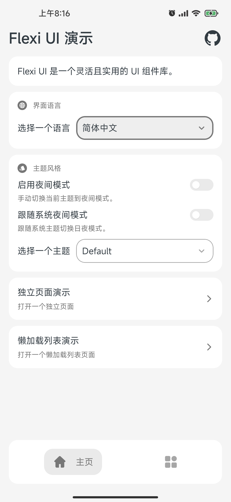
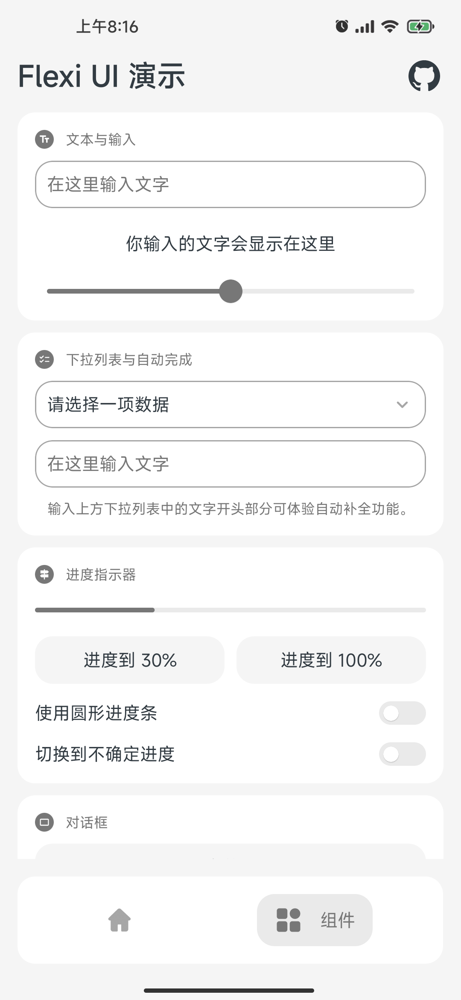
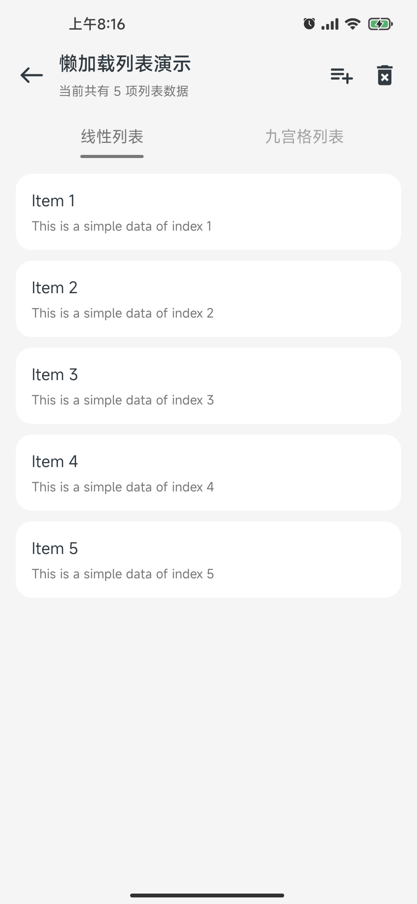
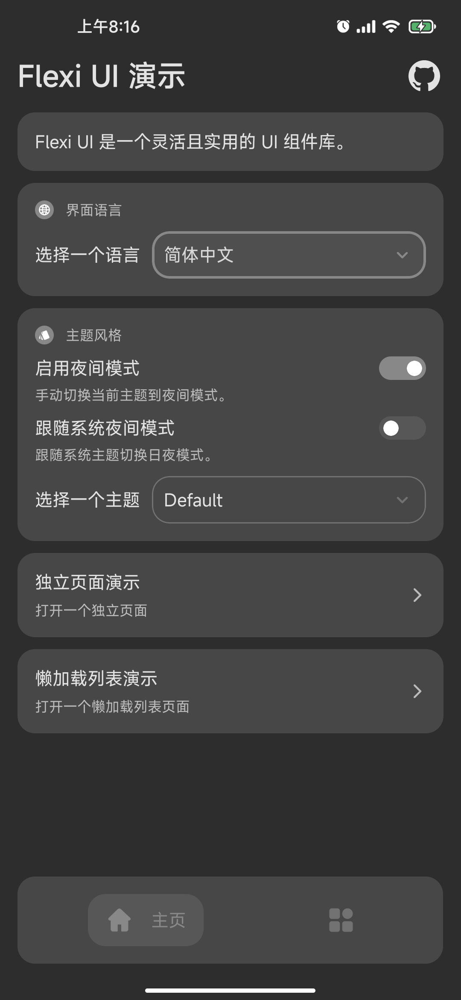
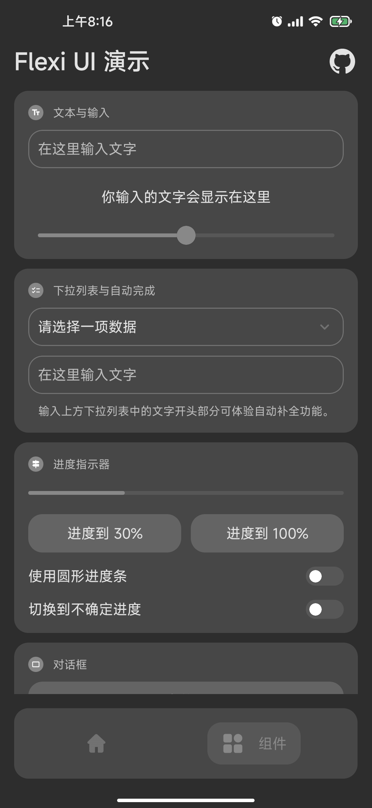
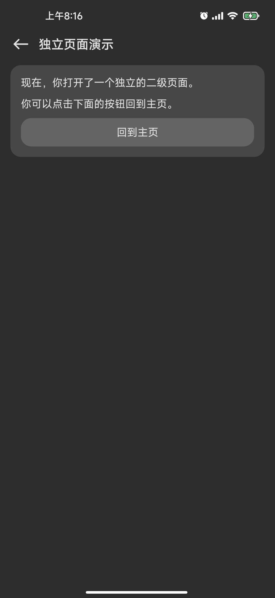
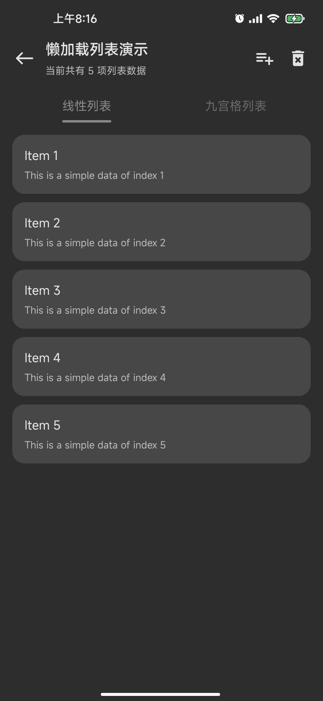

# Flexi UI

[](https://github.com/BetterAndroid/FlexiUI/blob/main/LICENSE)
[](https://t.me/BetterAndroid)
[](https://t.me/HighCapable_Dev)
[](https://qm.qq.com/cgi-bin/qm/qr?k=Pnsc5RY6N2mBKFjOLPiYldbAbprAU3V7&jump_from=webapi&authKey=X5EsOVzLXt1dRunge8ryTxDRrh9/IiW1Pua75eDLh9RE3KXE+bwXIYF5cWri/9lf)

一个灵活且实用的 UI 组件库。

[English](README.md) | 简体中文

|  | [BetterAndroid](https://github.com/BetterAndroid) |
| ------------------------------------------------------------------------------------------------------------------------------- | ------------------------------------------------- |

这个项目属于上述组织，**点击上方链接关注这个组织**，发现更多好项目。

## 项目介绍

一个灵活且实用的 UI 组件库，名称取自英文单词 "flexible"。

这套 UI 诞生的原因是因为目前在 Android 开发中，除了官方推荐的 Material Design 之外，没有完全能够拿来开箱即用的任何一套令我十分满意的 UI 设计规范。

这套 UI 不实际依赖于任何 Material 组件，但是它借鉴并重构了部分基础的 Material 风格元素 (例如我们熟悉的进度指示器和水波纹效果等) 和使用了部分 Android 平台的设计规范。

借助目前主流多平台框架的优势使得这套 UI 能复用不必要的原生 UI 代码在更多的平台上呈现，并可被熟悉开发语言的开发者快速引入并使用。

这个项目早期在 Android 原生平台已经有了一个初版 [FlexiUI-Preview](https://github.com/BetterAndroid/FlexiUI-Preview)，它在 2022 年就已经初步完工，但是我一直没有将它开源出来，因为项目整体耦合度过高且包含一些与 UI 无关的工具依赖，所以我将很多东西进行了解耦合并发布到了新的项目 [BetterAndroid](https://github.com/BetterAndroid/BetterAndroid) 中。

Android 原生平台的这个项目我正在对其进行重构，旧的 Preview 版本将不再积极维护并将在重构完成后被取代，如果你感兴趣，你可以点击页面上述的任何一个 `discussion` 加入对应的群组联系我添加查看权限。

## 开始使用

你可以点击下方链接查看对应平台的项目分支。

|  | Android View (正在重构) |
| ---------------------------------------------------------------------------------------------------------------- | ----------------------- |

|  | [Jetpack Compose](https://github.com/BetterAndroid/FlexiUI/tree/compose) |
| ----------------------------------------------------------------------------------------------------------------------------- | ------------------------------------------------------------------------ |


|  | Flutter (敬请期待) |
| ------------------------------------------------------------------------------------------------------------- | ------------------ |

## 设计规范

正在努力完善，预计近期发布，敬请期待。

## 演示截屏

<div style="display: flex">
  
  
  
  
</div>

<div style="display: flex">
  
  
  
  
</div>

## 项目推广

<!--suppress HtmlDeprecatedAttribute -->
<div align="center">
    <h2>嘿，还请君留步！👋</h2>
    <h3>这里有 Android 开发工具、UI 设计、Gradle 插件、Xposed 模块和实用软件等相关项目。</h3>
    <h3>如果下方的项目能为你提供帮助，不妨为我点个 star 吧！</h3>
    <h3>所有项目免费、开源，遵循对应开源许可协议。</h3>
    <h1><a href="https://github.com/fankes/fankes/blob/main/project-promote/README-zh-CN.md">→ 查看更多关于我的项目，请点击这里 ←</a></h1>
</div>

## Star History


## 许可证

- [Apache-2.0](https://www.apache.org/licenses/LICENSE-2.0)

```
Apache License Version 2.0

Copyright (C) 2019 HighCapable

Licensed under the Apache License, Version 2.0 (the "License");
you may not use this file except in compliance with the License.
You may obtain a copy of the License at

    https://www.apache.org/licenses/LICENSE-2.0

Unless required by applicable law or agreed to in writing, software
distributed under the License is distributed on an "AS IS" BASIS,
WITHOUT WARRANTIES OR CONDITIONS OF ANY KIND, either express or implied.
See the License for the specific language governing permissions and
limitations under the License.
```

版权所有 © 2019 HighCapable