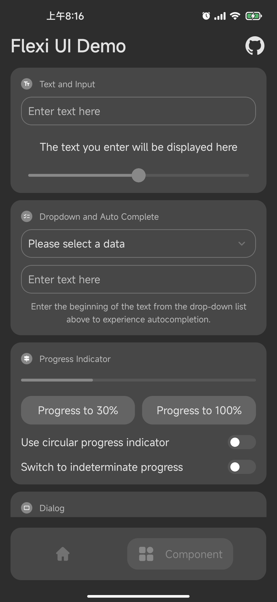

# Flexi UI

[](https://github.com/BetterAndroid/FlexiUI/blob/main/LICENSE)
[](https://t.me/BetterAndroid)
[](https://t.me/HighCapable_Dev)
[](https://qm.qq.com/cgi-bin/qm/qr?k=Pnsc5RY6N2mBKFjOLPiYldbAbprAU3V7&jump_from=webapi&authKey=X5EsOVzLXt1dRunge8ryTxDRrh9/IiW1Pua75eDLh9RE3KXE+bwXIYF5cWri/9lf)

A flexible and useful UI component library.

English | [简体中文](README-zh-CN.md)

|  | [BetterAndroid](https://github.com/BetterAndroid) |
| ------------------------------------------------------------------------------------------------------------------------------- | ------------------------------------------------- |

This project belongs to the above-mentioned organization, **click the link above to follow this organization** and discover more good projects.

## Project Introduction

A library of flexible and practical UI components, named after the word "flexible".

The reason why this UI was born is that currently in Android development, except for the officially recommended Material Design, there is no set of UI design specifications that I am completely satisfied with that can be used out-of-the-box.

This UI does not actually rely on any Material components, but it borrows and reconstructs some basic Material style elements (such as the familiar progress indicator and ripple effect) and uses some design specifications of the Android platform.

Taking advantage of the current mainstream multi-platform frameworks, this UI can reuse unnecessary native UI code to be presented on more platforms, and can be quickly introduced and used by developers who are familiar with development languages.

This project already had a first version [FlexiUI-Preview](https://github.com/BetterAndroid/FlexiUI-Preview) on the Android native platform in the early days, it will be initially completed in 2022, but I have never open sourced it, because the overall coupling of the project is too high and contains some tool dependencies that have nothing to do with the UI, so I decoupled a lot of things and published them into a new project [BetterAndroid](https://github.com/BetterAndroid/BetterAndroid).

I am refactoring this project for the Android native platform, the old preview version will no longer be actively maintained and will be replaced after the refactoring is completed, if you are interested, you can click on any `discussion` above on the page to join Contact me for the corresponding group to add viewing permissions.

## Get Started

You can click the link below to view the project branch of the corresponding platform.

|  | Android View (Refactoring) |
| ---------------------------------------------------------------------------------------------------------------- | -------------------------- |

|  | [Jetpack Compose](https://github.com/BetterAndroid/FlexiUI/tree/compose) |
| ----------------------------------------------------------------------------------------------------------------------------- | ------------------------------------------------------------------------ |


|  | Flutter (Stay tuned) |
| ------------------------------------------------------------------------------------------------------------- | -------------------- |

## Design Specifications

We are working hard to improve it and it is expected to be released soon, so stay tuned.

## Demo Screenshots

<div style="display: flex">
  
  
  
  
</div>

<div style="display: flex">
  
  
  
  
</div>

## Promotion

<!--suppress HtmlDeprecatedAttribute -->
<div align="center">
     <h2>Hey, please stay! 👋</h2>
     <h3>Here are related projects such as Android development tools, UI design, Gradle plugins, Xposed Modules and practical software. </h3>
     <h3>If the project below can help you, please give me a star! </h3>
     <h3>All projects are free, open source, and follow the corresponding open source license agreement. </h3>
     <h1><a href="https://github.com/fankes/fankes/blob/main/project-promote/README.md">→ To see more about my projects, please click here ←</a></h1>
</div>

## Star History


## License

- [Apache-2.0](https://www.apache.org/licenses/LICENSE-2.0)

```
Apache License Version 2.0

Copyright (C) 2019-2024 HighCapable

Licensed under the Apache License, Version 2.0 (the "License");
you may not use this file except in compliance with the License.
You may obtain a copy of the License at

    https://www.apache.org/licenses/LICENSE-2.0

Unless required by applicable law or agreed to in writing, software
distributed under the License is distributed on an "AS IS" BASIS,
WITHOUT WARRANTIES OR CONDITIONS OF ANY KIND, either express or implied.
See the License for the specific language governing permissions and
limitations under the License.
```

Copyright © 2019-2024 HighCapable